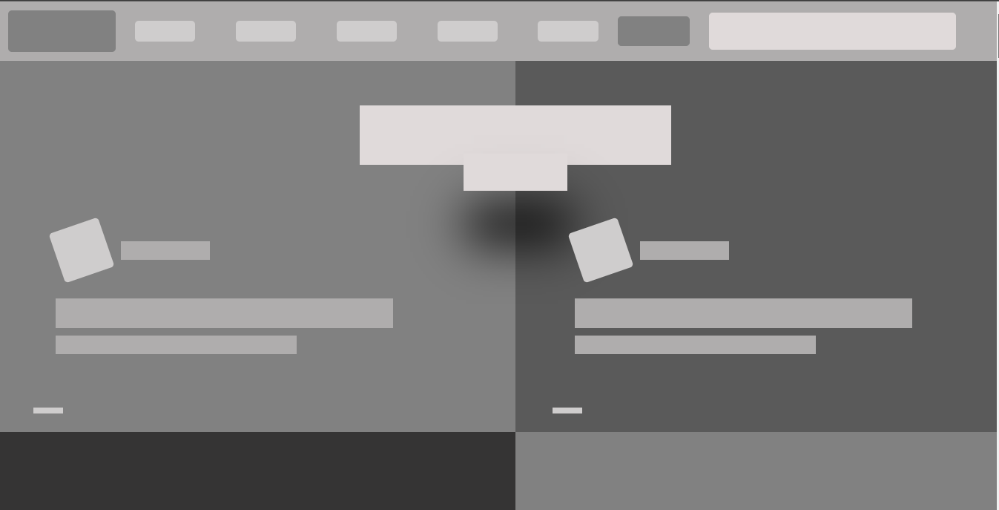

# Smashing Magazine Design Tear Down

This project consists of building a heatmap for the Smashing magazine website

## Sample of Smashing Magazine Website Clone with the following features:

- Navigation Bar
- Main section
- Articles
- Footer

## Built With

- HTML
- CSS

## Live Demo

[Live Demo Link](https://rawcdn.githack.com/helciodev/Design-Teardown/2ed6120c966c3ef8caf0d623c48395568190278d/index.html)

**See the page via the link above**

**See the Source Page via the link below**

[Source Page Link](https://www.smashingmagazine.com/)

## Authors

😎 **Helcio André**

- GitHub: [@helciodev](https://github.com/helciodev)
- Twitter: [@helcio_bruno](https://twitter.com/helcio_bruno)
- LinkedIn: [LinkedIn](https://www.linkedin.com/in/helcio-andre/)

👤 **Arrey Tabe**

- Github: [ArreyTabe](https://github.com/ArreyTabe)
- Twitter: [@tabe_arrey](https://twitter.com/tabe_arrey)
- LinkedIn: [Arrey Tabe](https://www.linkedin.com/in/arrey-affuembey-80a8b11a8)

## Show your support

Give a ⭐️ if you like this project!

## 📝 License

This project is [MIT](./license.txt) licensed.
